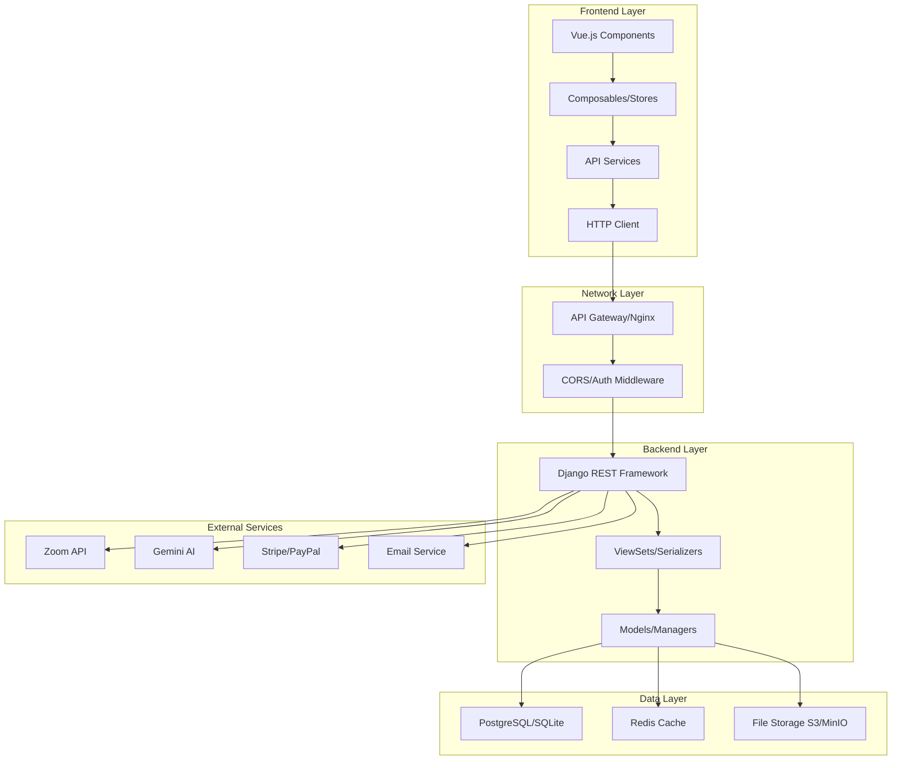
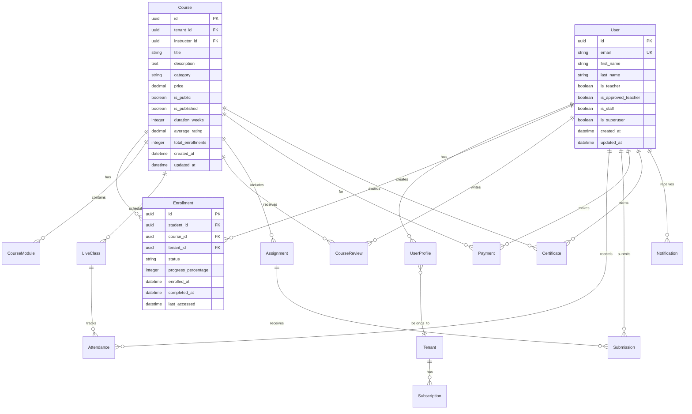

# Design Document

## Overview

The data integration verification feature ensures complete end-to-end connectivity between the Django REST Framework backend and Vue.js frontend, eliminating all mock data usage and establishing robust API connections. The design follows a systematic approach to identify, replace, and verify real data flows across all platform components while maintaining performance and user experience.

## Architecture

### High-Level Data Flow Architecture



### Data Integration Patterns

**1. API-First Pattern**
- All frontend components consume data exclusively through API endpoints
- No hardcoded mock data in components or stores
- Consistent error handling for API failures

**2. State Management Pattern**
- Pinia stores manage API data with proper loading/error states
- Composables provide reusable data fetching logic
- Reactive data updates across components

**3. Caching Strategy**
- Redis backend caching for frequently accessed data
- Frontend caching for static content and user preferences
- Cache invalidation on data mutations

## Components and Interfaces

### Backend API Verification

#### 1. API Endpoint Audit
```python
# apps/common/management/commands/audit_api_endpoints.py
class Command(BaseCommand):
    """Audit all API endpoints for completeness and functionality"""
    
    def handle(self, *args, **options):
        endpoints = self.discover_endpoints()
        for endpoint in endpoints:
            self.test_endpoint_functionality(endpoint)
            self.verify_serializer_completeness(endpoint)
            self.check_permission_classes(endpoint)
```

#### 2. Data Model Completeness Check
```python
# apps/common/utils/data_verification.py
class DataModelVerifier:
    """Verify all models have proper API exposure"""
    
    def verify_model_api_coverage(self):
        models = self.get_all_models()
        for model in models:
            self.check_viewset_exists(model)
            self.check_serializer_completeness(model)
            self.verify_crud_operations(model)
```

#### 3. Enhanced API Endpoints
```python
# Example: Enhanced Course ViewSet
class CourseViewSet(viewsets.ModelViewSet):
    serializer_class = CourseSerializer
    permission_classes = [IsAuthenticated]
    filter_backends = [DjangoFilterBackend, SearchFilter, OrderingFilter]
    filterset_fields = ['category', 'is_public', 'instructor']
    search_fields = ['title', 'description']
    ordering_fields = ['created_at', 'title', 'average_rating']
    
    def get_queryset(self):
        return Course.objects.select_related('instructor', 'tenant')\
                           .prefetch_related('enrollments', 'reviews')\
                           .filter(tenant=self.request.tenant)
    
    @action(detail=False, methods=['get'])
    def dashboard_stats(self, request):
        """Provide dashboard statistics for courses"""
        stats = self.get_queryset().aggregate(
            total_courses=Count('id'),
            published_courses=Count('id', filter=Q(is_published=True)),
            avg_rating=Avg('average_rating'),
            total_enrollments=Count('enrollments')
        )
        return Response(stats)
    
    @action(detail=True, methods=['get'])
    def analytics(self, request, pk=None):
        """Detailed course analytics"""
        course = self.get_object()
        analytics = {
            'enrollment_trend': self.get_enrollment_trend(course),
            'completion_rate': self.get_completion_rate(course),
            'engagement_metrics': self.get_engagement_metrics(course)
        }
        return Response(analytics)
```

### Frontend Data Integration

#### 1. API Service Layer Enhancement
```typescript
// services/api.ts - Enhanced with better error handling
class ApiService {
  private static instance: ApiService
  private client: AxiosInstance
  
  constructor() {
    this.client = axios.create({
      baseURL: import.meta.env.VITE_API_BASE_URL,
      timeout: 10000,
    })
    
    this.setupInterceptors()
  }
  
  private setupInterceptors() {
    // Request interceptor
    this.client.interceptors.request.use(
      (config) => this.addAuthHeaders(config),
      (error) => Promise.reject(error)
    )
    
    // Response interceptor with retry logic
    this.client.interceptors.response.use(
      (response) => response,
      async (error) => this.handleResponseError(error)
    )
  }
  
  private async handleResponseError(error: AxiosError) {
    if (error.response?.status === 401) {
      await this.refreshToken()
      return this.client.request(error.config!)
    }
    
    if (error.response?.status >= 500) {
      // Log server errors
      console.error('Server error:', error)
    }
    
    return Promise.reject(error)
  }
}
```

#### 2. Enhanced Composables for Data Fetching
```typescript
// composables/useApiData.ts
export const useApiData = <T>(
  endpoint: string,
  options: {
    immediate?: boolean
    transform?: (data: any) => T
    dependencies?: Ref[]
  } = {}
) => {
  const data = ref<T | null>(null)
  const loading = ref(false)
  const error = ref<string | null>(null)
  
  const fetch = async () => {
    loading.value = true
    error.value = null
    
    try {
      const response = await api.get(endpoint)
      data.value = options.transform 
        ? options.transform(response.data)
        : response.data
    } catch (err) {
      error.value = err instanceof Error ? err.message : 'Unknown error'
      console.error(`API Error for ${endpoint}:`, err)
    } finally {
      loading.value = false
    }
  }
  
  const refresh = () => fetch()
  
  // Auto-fetch on mount if immediate is true
  if (options.immediate !== false) {
    onMounted(fetch)
  }
  
  // Re-fetch when dependencies change
  if (options.dependencies) {
    watch(options.dependencies, fetch, { deep: true })
  }
  
  return {
    data: readonly(data),
    loading: readonly(loading),
    error: readonly(error),
    fetch,
    refresh
  }
}
```

#### 3. Dashboard Data Integration
```typescript
// composables/useDashboardData.ts
export const useDashboardData = () => {
  const { user } = useAuth()
  
  const studentData = useApiData('/courses/enrollments/dashboard/', {
    immediate: computed(() => !user.value?.is_teacher),
    transform: (data) => ({
      enrolledCourses: data.enrolled_courses,
      completedCourses: data.completed_courses,
      hoursLearned: data.total_hours,
      certificates: data.certificates,
      currentCourses: data.current_courses,
      recommendations: data.recommendations
    })
  })
  
  const teacherData = useApiData('/courses/courses/instructor_analytics/', {
    immediate: computed(() => user.value?.is_teacher),
    transform: (data) => ({
      totalCourses: data.total_courses,
      totalStudents: data.total_students,
      totalRevenue: data.total_revenue,
      courseStats: data.course_stats,
      recentEnrollments: data.recent_enrollments
    })
  })
  
  const adminData = useApiData('/admin/dashboard_stats/', {
    immediate: computed(() => user.value?.is_staff),
    transform: (data) => ({
      userStats: data.user_stats,
      courseStats: data.course_stats,
      revenueStats: data.revenue_stats,
      systemHealth: data.system_health
    })
  })
  
  return {
    studentData,
    teacherData,
    adminData
  }
}
```

#### 4. Component Data Integration
```vue
<!-- components/dashboard/StudentDashboard.vue -->
<template>
  <div class="student-dashboard">
    <!-- Loading State -->
    <div v-if="dashboardData.loading.value" class="loading-state">
      <LoadingSpinner />
      <p>Loading your dashboard...</p>
    </div>
    
    <!-- Error State -->
    <div v-else-if="dashboardData.error.value" class="error-state">
      <ErrorMessage :message="dashboardData.error.value" />
      <button @click="dashboardData.refresh()" class="retry-btn">
        Retry
      </button>
    </div>
    
    <!-- Data Content -->
    <div v-else-if="dashboardData.data.value" class="dashboard-content">
      <div class="stats-grid">
        <StatCard 
          title="Enrolled Courses"
          :value="dashboardData.data.value.enrolledCourses.length"
          icon="📚"
        />
        <StatCard 
          title="Completed Courses"
          :value="dashboardData.data.value.completedCourses.length"
          icon="✅"
        />
        <StatCard 
          title="Hours Learned"
          :value="dashboardData.data.value.hoursLearned"
          icon="⏱️"
        />
        <StatCard 
          title="Certificates"
          :value="dashboardData.data.value.certificates.length"
          icon="🏆"
        />
      </div>
      
      <CourseGrid 
        title="Continue Learning"
        :courses="dashboardData.data.value.currentCourses"
      />
      
      <CourseGrid 
        title="Recommended for You"
        :courses="dashboardData.data.value.recommendations"
      />
    </div>
  </div>
</template>

<script setup lang="ts">
import { useDashboardData } from '@/composables/useDashboardData'

const { studentData: dashboardData } = useDashboardData()
</script>
```

### Data Validation and Error Handling

#### 1. Backend Data Validation
```python
# apps/common/serializers.py
class BaseSerializer(serializers.ModelSerializer):
    """Base serializer with enhanced validation"""
    
    def validate(self, attrs):
        # Tenant-aware validation
        if hasattr(self.Meta.model, 'tenant'):
            attrs['tenant'] = self.context['request'].tenant
        
        # Custom validation logic
        return super().validate(attrs)
    
    def to_representation(self, instance):
        data = super().to_representation(instance)
        
        # Add computed fields
        if hasattr(instance, 'get_computed_fields'):
            data.update(instance.get_computed_fields())
        
        return data
```

#### 2. Frontend Error Boundaries
```typescript
// composables/useErrorHandler.ts
export const useErrorHandler = () => {
  const toast = useToast()
  
  const handleApiError = (error: any, context?: string) => {
    let message = 'An unexpected error occurred'
    
    if (error.response?.data?.message) {
      message = error.response.data.message
    } else if (error.message) {
      message = error.message
    }
    
    if (context) {
      message = `${context}: ${message}`
    }
    
    toast.error(message)
    
    // Log to monitoring service in production
    if (import.meta.env.PROD) {
      console.error('API Error:', { error, context })
    }
  }
  
  const handleValidationErrors = (errors: Record<string, string[]>) => {
    Object.entries(errors).forEach(([field, messages]) => {
      messages.forEach(message => {
        toast.error(`${field}: ${message}`)
      })
    })
  }
  
  return {
    handleApiError,
    handleValidationErrors
  }
}
```

### Performance Optimization

#### 1. Backend Query Optimization
```python
# apps/common/mixins.py
class OptimizedQueryMixin:
    """Mixin for optimized database queries"""
    
    def get_queryset(self):
        queryset = super().get_queryset()
        
        # Apply select_related for foreign keys
        if hasattr(self, 'select_related_fields'):
            queryset = queryset.select_related(*self.select_related_fields)
        
        # Apply prefetch_related for many-to-many and reverse foreign keys
        if hasattr(self, 'prefetch_related_fields'):
            queryset = queryset.prefetch_related(*self.prefetch_related_fields)
        
        # Apply tenant filtering
        if hasattr(self.model, 'tenant'):
            queryset = queryset.filter(tenant=self.request.tenant)
        
        return queryset
```

#### 2. Frontend Caching Strategy
```typescript
// utils/cache.ts
class ApiCache {
  private cache = new Map<string, { data: any; timestamp: number; ttl: number }>()
  
  set(key: string, data: any, ttl: number = 300000) { // 5 minutes default
    this.cache.set(key, {
      data,
      timestamp: Date.now(),
      ttl
    })
  }
  
  get(key: string): any | null {
    const cached = this.cache.get(key)
    
    if (!cached) return null
    
    if (Date.now() - cached.timestamp > cached.ttl) {
      this.cache.delete(key)
      return null
    }
    
    return cached.data
  }
  
  invalidate(pattern: string) {
    for (const key of this.cache.keys()) {
      if (key.includes(pattern)) {
        this.cache.delete(key)
      }
    }
  }
}

export const apiCache = new ApiCache()
```

## Data Models

### Enhanced Model Relationships



### API Response Standardization

```python
# apps/common/responses.py
class StandardAPIResponse:
    """Standardized API response format"""
    
    @staticmethod
    def success(data=None, message=None, status_code=200):
        return Response({
            'success': True,
            'data': data,
            'message': message,
            'timestamp': timezone.now().isoformat()
        }, status=status_code)
    
    @staticmethod
    def error(message, errors=None, status_code=400):
        return Response({
            'success': False,
            'message': message,
            'errors': errors,
            'timestamp': timezone.now().isoformat()
        }, status=status_code)
    
    @staticmethod
    def paginated(queryset, serializer_class, request):
        paginator = PageNumberPagination()
        page = paginator.paginate_queryset(queryset, request)
        serializer = serializer_class(page, many=True, context={'request': request})
        
        return paginator.get_paginated_response({
            'success': True,
            'data': serializer.data,
            'timestamp': timezone.now().isoformat()
        })
```

## Error Handling

### Comprehensive Error Management

#### 1. Backend Error Handling
```python
# apps/common/exceptions.py
class APIException(Exception):
    """Base API exception"""
    default_message = "An error occurred"
    default_code = "api_error"
    status_code = 400
    
    def __init__(self, message=None, code=None):
        self.message = message or self.default_message
        self.code = code or self.default_code

class DataIntegrityError(APIException):
    default_message = "Data integrity violation"
    default_code = "data_integrity_error"
    status_code = 409

class TenantAccessError(APIException):
    default_message = "Access denied for this tenant"
    default_code = "tenant_access_error"
    status_code = 403

# Custom exception handler
def custom_exception_handler(exc, context):
    if isinstance(exc, APIException):
        return StandardAPIResponse.error(
            message=exc.message,
            status_code=exc.status_code
        )
    
    return exception_handler(exc, context)
```

#### 2. Frontend Error Handling
```typescript
// stores/errorStore.ts
export const useErrorStore = defineStore('error', () => {
  const errors = ref<Array<{ id: string; message: string; type: string }>>([])
  
  const addError = (message: string, type: 'api' | 'validation' | 'network' = 'api') => {
    const id = Date.now().toString()
    errors.value.push({ id, message, type })
    
    // Auto-remove after 5 seconds
    setTimeout(() => removeError(id), 5000)
  }
  
  const removeError = (id: string) => {
    const index = errors.value.findIndex(error => error.id === id)
    if (index > -1) {
      errors.value.splice(index, 1)
    }
  }
  
  const clearErrors = () => {
    errors.value = []
  }
  
  return {
    errors: readonly(errors),
    addError,
    removeError,
    clearErrors
  }
})
```

## Testing Strategy

### Backend API Testing
```python
# tests/test_data_integration.py
class DataIntegrationTestCase(APITestCase):
    def setUp(self):
        self.tenant = TenantFactory()
        self.user = UserFactory(tenant=self.tenant)
        self.client.force_authenticate(user=self.user)
    
    def test_dashboard_data_completeness(self):
        """Test that dashboard endpoints return complete data"""
        # Create test data
        course = CourseFactory(tenant=self.tenant, instructor=self.user)
        EnrollmentFactory(student=self.user, course=course, tenant=self.tenant)
        
        response = self.client.get('/api/v1/courses/enrollments/dashboard/')
        
        self.assertEqual(response.status_code, 200)
        data = response.json()
        
        # Verify all required fields are present
        required_fields = [
            'enrolled_courses', 'completed_courses', 'total_hours',
            'certificates', 'current_courses', 'recommendations'
        ]
        
        for field in required_fields:
            self.assertIn(field, data)
            self.assertIsNotNone(data[field])
    
    def test_api_error_handling(self):
        """Test proper error responses"""
        # Test unauthorized access
        self.client.logout()
        response = self.client.get('/api/v1/courses/courses/')
        
        self.assertEqual(response.status_code, 401)
        self.assertIn('message', response.json())
```

### Frontend Integration Testing
```typescript
// tests/integration/dashboard.spec.ts
import { mount } from '@vue/test-utils'
import { createTestingPinia } from '@pinia/testing'
import StudentDashboard from '@/components/dashboard/StudentDashboard.vue'

describe('StudentDashboard Integration', () => {
  it('loads real data from API', async () => {
    // Mock API response
    const mockApiResponse = {
      enrolled_courses: [{ id: '1', title: 'Test Course' }],
      completed_courses: [],
      total_hours: 10,
      certificates: [],
      current_courses: [],
      recommendations: []
    }
    
    vi.mocked(api.get).mockResolvedValue({ data: mockApiResponse })
    
    const wrapper = mount(StudentDashboard, {
      global: {
        plugins: [createTestingPinia()]
      }
    })
    
    // Wait for API call to complete
    await wrapper.vm.$nextTick()
    await new Promise(resolve => setTimeout(resolve, 0))
    
    // Verify data is displayed
    expect(wrapper.text()).toContain('1') // enrolled courses count
    expect(wrapper.text()).toContain('10') // hours learned
    
    // Verify API was called
    expect(api.get).toHaveBeenCalledWith('/courses/enrollments/dashboard/')
  })
  
  it('handles API errors gracefully', async () => {
    vi.mocked(api.get).mockRejectedValue(new Error('Network error'))
    
    const wrapper = mount(StudentDashboard, {
      global: {
        plugins: [createTestingPinia()]
      }
    })
    
    await wrapper.vm.$nextTick()
    await new Promise(resolve => setTimeout(resolve, 0))
    
    // Verify error state is shown
    expect(wrapper.find('.error-state').exists()).toBe(true)
    expect(wrapper.text()).toContain('Network error')
  })
})
```

This design document provides a comprehensive approach to ensuring complete data integration between the backend and frontend, eliminating mock data usage while maintaining performance and user experience.