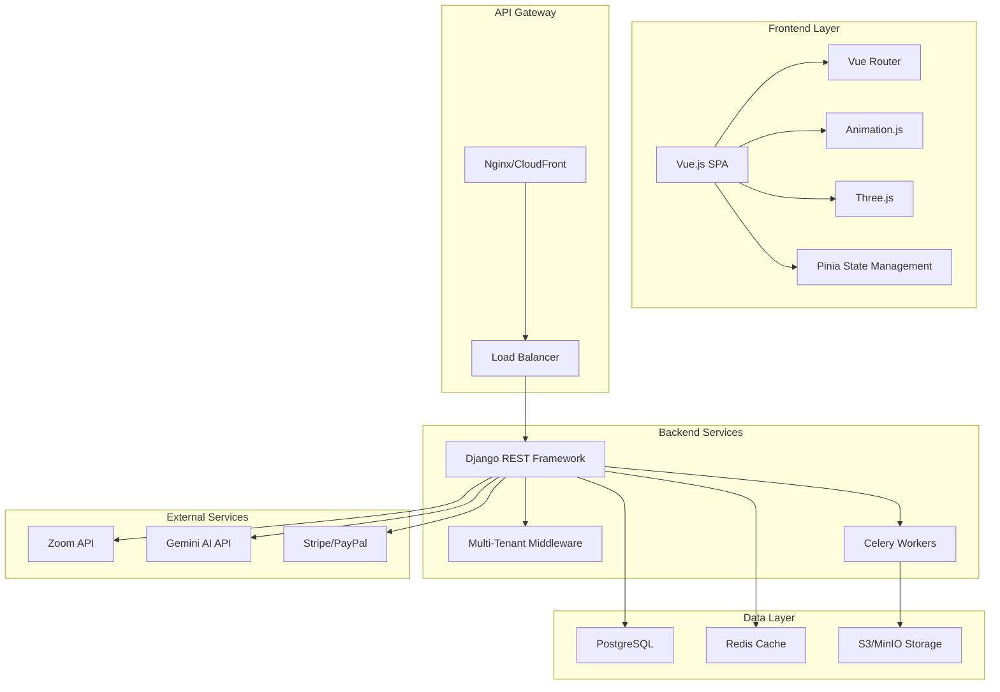
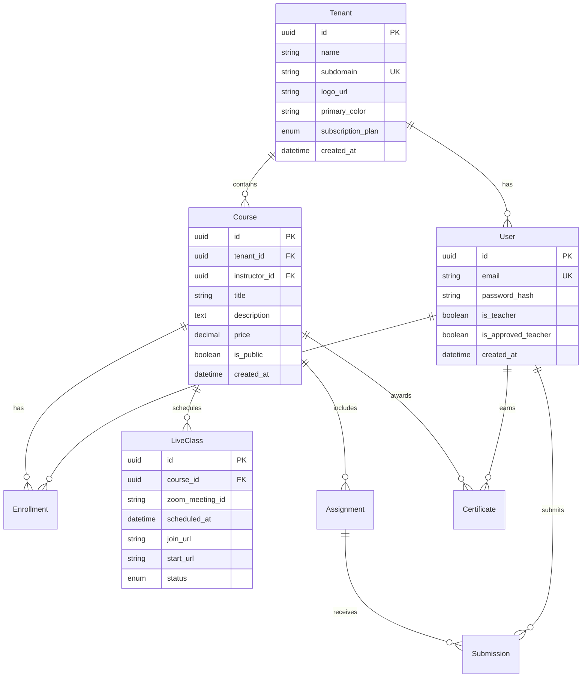

# Design Document

## Overview

Edurise is a multi-tenant SaaS LMS platform built with Django REST Framework backend and Vue.js frontend. The architecture follows Django and Vue.js best practices, implementing a clean separation of concerns with tenant isolation, real-time capabilities, AI integration, and immersive 3D user experiences.

## Architecture

### High-Level Architecture



### Multi-Tenant Architecture Pattern

**Shared Database with Tenant Isolation:**
- Single PostgreSQL database with tenant-aware queries
- Custom Django middleware for automatic tenant detection
- Row-level security using tenant_id foreign keys
- Subdomain-based tenant routing

## Components and Interfaces

### Backend Components (Django Best Practices)

#### 1. Project Structure
```
backend/
├── config/
│   ├── settings/
│   │   ├── base.py          # Base settings
│   │   ├── development.py   # Dev-specific settings
│   │   ├── production.py    # Prod-specific settings
│   │   └── test.py         # Test settings
│   ├── urls.py             # Root URL configuration
│   └── wsgi.py/asgi.py     # WSGI/ASGI application
├── apps/
│   ├── accounts/           # User management
│   ├── tenants/           # Multi-tenant logic
│   ├── courses/           # Course management
│   ├── live_classes/      # Zoom integration
│   ├── assignments/       # Assignment system
│   ├── payments/          # Payment processing
│   ├── ai_services/       # AI integration
│   ├── notifications/     # Notification system
│   └── common/            # Shared utilities
├── requirements/
│   ├── base.txt
│   ├── development.txt
│   └── production.txt
└── tests/
```

#### 2. Core Django Apps

**accounts/ - Authentication & User Management**
```python
# models.py
class User(AbstractUser):
    email = models.EmailField(unique=True)
    is_teacher = models.BooleanField(default=False)
    is_approved_teacher = models.BooleanField(default=False)
    
class UserProfile(models.Model):
    user = models.OneToOneField(User, on_delete=models.CASCADE)
    tenant = models.ForeignKey('tenants.Tenant', on_delete=models.CASCADE)
    avatar = models.ImageField(upload_to='avatars/')
    
# serializers.py (DRF Best Practices)
class UserSerializer(serializers.ModelSerializer):
    class Meta:
        model = User
        fields = ['id', 'email', 'first_name', 'last_name']
        read_only_fields = ['id']
        
# views.py (Class-Based Views)
class UserViewSet(viewsets.ModelViewSet):
    serializer_class = UserSerializer
    permission_classes = [IsAuthenticated]
    
    def get_queryset(self):
        return User.objects.filter(
            userprofile__tenant=self.request.tenant
        )
```

**tenants/ - Multi-Tenant Management**
```python
# models.py
class Tenant(models.Model):
    name = models.CharField(max_length=100)
    subdomain = models.SlugField(unique=True)
    logo = models.ImageField(upload_to='tenant_logos/')
    primary_color = models.CharField(max_length=7)  # Hex color
    subscription_plan = models.CharField(
        max_length=20,
        choices=[('basic', 'Basic'), ('pro', 'Pro'), ('enterprise', 'Enterprise')]
    )
    
# middleware.py
class TenantMiddleware:
    def __init__(self, get_response):
        self.get_response = get_response
        
    def __call__(self, request):
        subdomain = self.get_subdomain(request)
        try:
            request.tenant = Tenant.objects.get(subdomain=subdomain)
        except Tenant.DoesNotExist:
            request.tenant = None
        return self.get_response(request)
```

**courses/ - Course Management**
```python
# models.py
class Course(TenantAwareModel):
    title = models.CharField(max_length=200)
    description = models.TextField()
    instructor = models.ForeignKey(User, on_delete=models.CASCADE)
    is_public = models.BooleanField(default=False)  # Marketplace vs internal
    price = models.DecimalField(max_digits=10, decimal_places=2, null=True)
    
class Enrollment(TenantAwareModel):
    student = models.ForeignKey(User, on_delete=models.CASCADE)
    course = models.ForeignKey(Course, on_delete=models.CASCADE)
    enrolled_at = models.DateTimeField(auto_now_add=True)
    completed_at = models.DateTimeField(null=True, blank=True)
```

#### 3. Django Best Practices Implementation

**Custom Model Manager for Tenant Filtering:**
```python
class TenantAwareManager(models.Manager):
    def get_queryset(self):
        return super().get_queryset().filter(tenant=get_current_tenant())

class TenantAwareModel(models.Model):
    tenant = models.ForeignKey(Tenant, on_delete=models.CASCADE)
    objects = TenantAwareManager()
    
    class Meta:
        abstract = True
```

**Settings Configuration:**
```python
# base.py
DJANGO_APPS = [
    'django.contrib.admin',
    'django.contrib.auth',
    'django.contrib.contenttypes',
    'django.contrib.sessions',
    'django.contrib.messages',
    'django.contrib.staticfiles',
]

THIRD_PARTY_APPS = [
    'rest_framework',
    'rest_framework_simplejwt',
    'corsheaders',
    'celery',
    'django_extensions',
]

LOCAL_APPS = [
    'apps.accounts',
    'apps.tenants',
    'apps.courses',
    'apps.live_classes',
    'apps.assignments',
    'apps.payments',
    'apps.ai_services',
    'apps.notifications',
    'apps.common',
]

INSTALLED_APPS = DJANGO_APPS + THIRD_PARTY_APPS + LOCAL_APPS
```

### Frontend Components (Vue.js Best Practices)

#### 1. Project Structure
```
frontend/
├── vite.config.js
├── package.json
├── index.html
├── src/
│   ├── main.js            # Vue app entry point
│   ├── App.vue            # Root component
│   ├── router/            # Vue Router configuration
│   ├── components/
│   │   ├── Base/          # Reusable base components
│   │   ├── Auth/          # Authentication components
│   │   ├── Course/        # Course-related components
│   │   ├── Animation/     # Animation.js wrappers
│   │   └── ThreeD/        # Three.js components
│   ├── composables/       # Vue 3 Composables
│   ├── views/             # Page components
│   ├── stores/            # Pinia stores
│   ├── plugins/           # Vue plugins
│   ├── middleware/        # Route guards
│   └── assets/            # Static assets
└── public/                # Public static files
```

#### 2. Vue.js Best Practices Implementation

**Composables for Reusable Logic:**
```typescript
// composables/useAuth.ts
export const useAuth = () => {
  const user = ref(null)
  const isAuthenticated = computed(() => !!user.value)
  
  const login = async (credentials: LoginCredentials) => {
    const { data } = await $fetch('/api/auth/login', {
      method: 'POST',
      body: credentials
    })
    user.value = data.user
    await navigateTo('/dashboard')
  }
  
  return {
    user: readonly(user),
    isAuthenticated,
    login,
    logout,
    register
  }
}

// composables/useTenant.ts
export const useTenant = () => {
  const tenant = ref(null)
  const branding = computed(() => tenant.value?.branding || {})
  
  const detectTenant = () => {
    const subdomain = window.location.hostname.split('.')[0]
    return $fetch(`/api/tenants/${subdomain}`)
  }
  
  return {
    tenant: readonly(tenant),
    branding,
    detectTenant
  }
}
```

**Pinia Stores with TypeScript:**
```typescript
// stores/auth.ts
export const useAuthStore = defineStore('auth', () => {
  const user = ref<User | null>(null)
  const token = ref<string | null>(null)
  
  const isAuthenticated = computed(() => !!token.value)
  
  const login = async (credentials: LoginCredentials) => {
    const response = await authAPI.login(credentials)
    user.value = response.user
    token.value = response.token
    
    // Store in localStorage for persistence
    localStorage.setItem('auth_token', token.value)
  }
  
  const logout = () => {
    user.value = null
    token.value = null
    localStorage.removeItem('auth_token')
  }
  
  return {
    user,
    token,
    isAuthenticated,
    login,
    logout
  }
})
```

**Animation.js Integration:**
```typescript
// composables/useAnimations.ts
import anime from 'animejs'

export const useAnimations = () => {
  const fadeIn = (target: string | Element) => {
    return anime({
      targets: target,
      opacity: [0, 1],
      translateY: [20, 0],
      duration: 600,
      easing: 'easeOutQuart'
    })
  }
  
  const slideIn = (target: string | Element, direction: 'left' | 'right' = 'left') => {
    const translateX = direction === 'left' ? [-100, 0] : [100, 0]
    return anime({
      targets: target,
      translateX,
      opacity: [0, 1],
      duration: 800,
      easing: 'easeOutExpo'
    })
  }
  
  const morphButton = (target: string | Element) => {
    return anime({
      targets: target,
      scale: [1, 1.05, 1],
      duration: 300,
      easing: 'easeInOutQuad'
    })
  }
  
  return {
    fadeIn,
    slideIn,
    morphButton
  }
}
```

**Three.js Integration:**
```typescript
// composables/useThreeJS.ts
import * as THREE from 'three'

export const useThreeJS = () => {
  const scene = ref<THREE.Scene | null>(null)
  const camera = ref<THREE.PerspectiveCamera | null>(null)
  const renderer = ref<THREE.WebGLRenderer | null>(null)
  
  const initScene = (container: HTMLElement) => {
    scene.value = new THREE.Scene()
    camera.value = new THREE.PerspectiveCamera(
      75,
      container.clientWidth / container.clientHeight,
      0.1,
      1000
    )
    
    renderer.value = new THREE.WebGLRenderer({ antialias: true })
    renderer.value.setSize(container.clientWidth, container.clientHeight)
    container.appendChild(renderer.value.domElement)
  }
  
  const createCourseVisualization = () => {
    // Create 3D course progress visualization
    const geometry = new THREE.SphereGeometry(1, 32, 32)
    const material = new THREE.MeshBasicMaterial({ color: 0x00ff00 })
    const sphere = new THREE.Mesh(geometry, material)
    scene.value?.add(sphere)
  }
  
  return {
    scene,
    camera,
    renderer,
    initScene,
    createCourseVisualization
  }
}
```

## Data Models

### Core Models Schema



### Database Optimization

**Indexing Strategy:**
```sql
-- Tenant-aware queries optimization
CREATE INDEX idx_course_tenant_public ON courses(tenant_id, is_public);
CREATE INDEX idx_enrollment_student_course ON enrollments(student_id, course_id);
CREATE INDEX idx_liveclass_course_scheduled ON live_classes(course_id, scheduled_at);

-- Full-text search for marketplace
CREATE INDEX idx_course_search ON courses USING gin(to_tsvector('english', title || ' ' || description));
```

## Error Handling

### Backend Error Handling

**Custom Exception Classes:**
```python
# common/exceptions.py
class TenantNotFoundError(Exception):
    pass

class InsufficientPermissionsError(Exception):
    pass

class AIQuotaExceededError(Exception):
    pass

# Custom DRF Exception Handler
def custom_exception_handler(exc, context):
    response = exception_handler(exc, context)
    
    if response is not None:
        custom_response_data = {
            'error': {
                'status_code': response.status_code,
                'message': response.data.get('detail', 'An error occurred'),
                'timestamp': timezone.now().isoformat()
            }
        }
        response.data = custom_response_data
    
    return response
```

### Frontend Error Handling

**Global Error Handler:**
```typescript
// plugins/error-handler.ts
export default defineNuxtPlugin(() => {
  const handleError = (error: any) => {
    console.error('Global error:', error)
    
    // Show user-friendly error message
    const toast = useToast()
    toast.error(error.message || 'An unexpected error occurred')
    
    // Log to monitoring service
    if (process.env.NODE_ENV === 'production') {
      // Send to Sentry or similar
    }
  }
  
  // Handle unhandled promise rejections
  window.addEventListener('unhandledrejection', (event) => {
    handleError(event.reason)
  })
})
```

## Testing Strategy

### Backend Testing

**Test Structure:**
```python
# tests/test_courses.py
class CourseViewSetTestCase(APITestCase):
    def setUp(self):
        self.tenant = TenantFactory()
        self.user = UserFactory(tenant=self.tenant)
        self.client.force_authenticate(user=self.user)
        
    def test_create_course_with_tenant_isolation(self):
        data = {
            'title': 'Test Course',
            'description': 'Test Description'
        }
        response = self.client.post('/api/courses/', data)
        self.assertEqual(response.status_code, 201)
        self.assertEqual(Course.objects.get().tenant, self.tenant)
        
    def test_cannot_access_other_tenant_courses(self):
        other_tenant = TenantFactory()
        other_course = CourseFactory(tenant=other_tenant)
        
        response = self.client.get(f'/api/courses/{other_course.id}/')
        self.assertEqual(response.status_code, 404)
```

### Frontend Testing

**Component Testing with Vue Test Utils:**
```typescript
// tests/components/CourseCard.spec.ts
import { mount } from '@vue/test-utils'
import CourseCard from '~/components/Course/CourseCard.vue'

describe('CourseCard', () => {
  it('renders course information correctly', () => {
    const course = {
      id: '1',
      title: 'Test Course',
      description: 'Test Description',
      price: 99.99
    }
    
    const wrapper = mount(CourseCard, {
      props: { course }
    })
    
    expect(wrapper.text()).toContain('Test Course')
    expect(wrapper.text()).toContain('$99.99')
  })
  
  it('emits enroll event when button clicked', async () => {
    const wrapper = mount(CourseCard, {
      props: { course: mockCourse }
    })
    
    await wrapper.find('[data-testid="enroll-button"]').trigger('click')
    expect(wrapper.emitted('enroll')).toBeTruthy()
  })
})
```

### Integration Testing

**E2E Testing with Playwright:**
```typescript
// tests/e2e/course-enrollment.spec.ts
import { test, expect } from '@playwright/test'

test('user can enroll in marketplace course', async ({ page }) => {
  await page.goto('/marketplace')
  
  // Find and click on a course
  await page.click('[data-testid="course-card"]:first-child')
  
  // Verify course details page
  await expect(page.locator('h1')).toContainText('Course Title')
  
  // Click enroll button
  await page.click('[data-testid="enroll-button"]')
  
  // Complete payment flow
  await page.fill('[data-testid="card-number"]', '4242424242424242')
  await page.click('[data-testid="pay-button"]')
  
  // Verify enrollment success
  await expect(page.locator('.success-message')).toBeVisible()
})
```

## Performance Considerations

### Backend Performance

**Database Query Optimization:**
```python
# Use select_related and prefetch_related
def get_queryset(self):
    return Course.objects.select_related('instructor', 'tenant')\
                        .prefetch_related('enrollments__student')\
                        .filter(tenant=self.request.tenant)

# Implement caching
from django.core.cache import cache

def get_popular_courses(tenant_id):
    cache_key = f'popular_courses_{tenant_id}'
    courses = cache.get(cache_key)
    
    if not courses:
        courses = Course.objects.filter(
            tenant_id=tenant_id,
            is_public=True
        ).annotate(
            enrollment_count=Count('enrollments')
        ).order_by('-enrollment_count')[:10]
        
        cache.set(cache_key, courses, 300)  # 5 minutes
    
    return courses
```

### Frontend Performance

**Code Splitting and Lazy Loading:**
```typescript
// vite.config.js
export default defineConfig({
  plugins: [vue()],
  build: {
    rollupOptions: {
      output: {
        manualChunks: {
          'three': ['three'],
          'animation': ['animejs'],
          'vendor': ['vue', 'vue-router', 'pinia']
        }
      }
    }
  }
})

// router/index.js - Route-based code splitting
const routes = [
  {
    path: '/courses',
    component: () => import('../views/CoursesView.vue')
  },
  {
    path: '/3d-visualization',
    component: () => import('../views/ThreeDView.vue')
  }
]

// Lazy load heavy 3D components
const ThreeDVisualization = defineAsyncComponent(() => 
  import('../components/ThreeD/Visualization.vue')
)
```

This design document provides a comprehensive technical foundation following Django and Vue.js best practices, ensuring scalability, maintainability, and performance for the Edurise LMS platform.