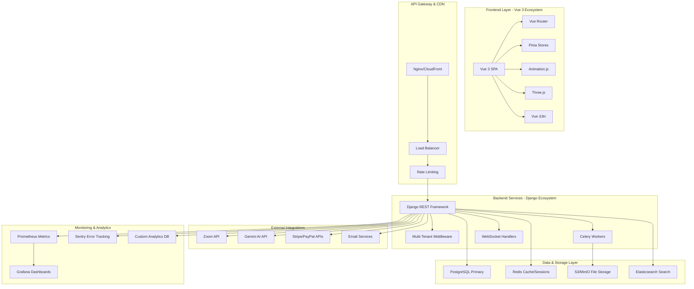

# EduRise LMS Platform Completion Design

## Overview

This design document provides a comprehensive technical architecture for completing the EduRise LMS platform. It consolidates all previous work and defines the technical approach for implementing remaining features to achieve a production-ready, scalable learning management system.

## Current Architecture Status

### ✅ **IMPLEMENTED COMPONENTS**
- **Backend**: Django REST Framework with centralized API structure
- **Database**: PostgreSQL with multi-tenant architecture
- **Authentication**: JWT-based auth with Google OAuth
- **Frontend Foundation**: Vue 3 + Vite + TypeScript + Pinia
- **API Integration**: Standardized API responses and error handling
- **Basic Real-time**: WebSocket infrastructure in place

### 🔄 **PARTIALLY IMPLEMENTED**
- **Frontend Integration**: Admin views connected, others using fallback data
- **Security Monitoring**: Basic structure with mock data components
- **Performance Optimization**: Basic caching and query optimization
- **Mobile Responsiveness**: Basic responsive design needs enhancement

### ❌ **MISSING COMPONENTS**
- **Wishlist System**: No backend model or frontend integration
- **Advanced AI Features**: Basic structure needs full implementation
- **Comprehensive Testing**: Limited coverage across components
- **Internationalization**: No i18n implementation
- **Advanced Analytics**: Basic reporting needs enhancement

## Architecture Enhancement Strategy

### Enhanced System Architecture



## Component Implementation Strategy

### 1. Complete Frontend Integration Architecture

#### Enhanced API Service Layer
```typescript
// services/api.ts - Production-ready API client
class ApiService {
  private client: AxiosInstance
  private cache: Map<string, CacheEntry> = new Map()
  
  constructor() {
    this.client = axios.create({
      baseURL: import.meta.env.VITE_API_BASE_URL,
      timeout: 15000,
    })
    this.setupInterceptors()
  }
  
  private setupInterceptors() {
    // Request interceptor with caching
    this.client.interceptors.request.use(
      (config) => this.handleRequest(config),
      (error) => Promise.reject(error)
    )
    
    // Response interceptor with retry and error handling
    this.client.interceptors.response.use(
      (response) => this.handleResponse(response),
      (error) => this.handleError(error)
    )
  }
}
```

#### Advanced State Management with Pinia
```typescript
// stores/platform.ts - Centralized platform state
export const usePlatformStore = defineStore('platform', () => {
  const user = ref<User | null>(null)
  const tenant = ref<Tenant | null>(null)
  const notifications = ref<Notification[]>([])
  const realTimeConnection = ref<WebSocket | null>(null)
  
  // Computed properties
  const isAuthenticated = computed(() => !!user.value)
  const userRole = computed(() => user.value?.role)
  const tenantFeatures = computed(() => tenant.value?.subscription_features)
  
  // Actions
  const initializePlatform = async () => {
    await Promise.all([
      loadUserData(),
      loadTenantData(),
      initializeWebSocket(),
      loadNotifications()
    ])
  }
  
  return {
    user, tenant, notifications,
    isAuthenticated, userRole, tenantFeatures,
    initializePlatform
  }
})
```#
## 2. Wishlist System Implementation

#### Backend Model Design
```python
# apps/courses/models.py
class Wishlist(TenantAwareModel):
    user = models.ForeignKey(User, on_delete=models.CASCADE)
    course = models.ForeignKey(Course, on_delete=models.CASCADE)
    added_at = models.DateTimeField(auto_now_add=True)
    notes = models.TextField(blank=True)
    
    class Meta:
        unique_together = ['user', 'course', 'tenant']
        
class WishlistViewSet(StandardViewSetMixin, viewsets.ModelViewSet):
    serializer_class = WishlistSerializer
    permission_classes = [IsAuthenticated]
    
    def get_queryset(self):
        return Wishlist.objects.filter(
            user=self.request.user,
            tenant=self.request.tenant
        ).select_related('course', 'course__instructor')
```

#### Frontend Wishlist Integration
```typescript
// composables/useWishlist.ts
export const useWishlist = () => {
  const wishlistItems = ref<WishlistItem[]>([])
  const loading = ref(false)
  
  const addToWishlist = async (courseId: string) => {
    loading.value = true
    try {
      await api.post('/wishlist/', { course_id: courseId })
      await refreshWishlist()
      toast.success('Course added to wishlist')
    } catch (error) {
      handleError(error)
    } finally {
      loading.value = false
    }
  }
  
  const removeFromWishlist = async (courseId: string) => {
    await api.delete(`/wishlist/${courseId}/`)
    wishlistItems.value = wishlistItems.value.filter(
      item => item.course.id !== courseId
    )
  }
  
  return { wishlistItems, addToWishlist, removeFromWishlist }
}
```

### 3. Real-Time Features Enhancement

#### WebSocket Service Implementation
```typescript
// services/websocket.ts
class WebSocketService {
  private ws: WebSocket | null = null
  private reconnectAttempts = 0
  private maxReconnectAttempts = 5
  private eventHandlers = new Map<string, Function[]>()
  
  connect(token: string) {
    const wsUrl = `${import.meta.env.VITE_WS_URL}?token=${token}`
    this.ws = new WebSocket(wsUrl)
    
    this.ws.onopen = () => {
      console.log('WebSocket connected')
      this.reconnectAttempts = 0
    }
    
    this.ws.onmessage = (event) => {
      const data = JSON.parse(event.data)
      this.handleMessage(data)
    }
    
    this.ws.onclose = () => {
      this.handleReconnection()
    }
  }
  
  private handleMessage(data: any) {
    const handlers = this.eventHandlers.get(data.type) || []
    handlers.forEach(handler => handler(data.payload))
  }
  
  subscribe(eventType: string, handler: Function) {
    if (!this.eventHandlers.has(eventType)) {
      this.eventHandlers.set(eventType, [])
    }
    this.eventHandlers.get(eventType)!.push(handler)
  }
}
```

### 4. Advanced Security Implementation

#### Enhanced Security Monitoring
```python
# apps/security/models.py
class SecurityEvent(models.Model):
    EVENT_TYPES = [
        ('failed_login', 'Failed Login'),
        ('suspicious_activity', 'Suspicious Activity'),
        ('data_breach_attempt', 'Data Breach Attempt'),
        ('unauthorized_access', 'Unauthorized Access'),
    ]
    
    event_type = models.CharField(max_length=50, choices=EVENT_TYPES)
    user = models.ForeignKey(User, on_delete=models.SET_NULL, null=True)
    ip_address = models.GenericIPAddressField()
    user_agent = models.TextField()
    details = models.JSONField()
    severity = models.CharField(max_length=20)
    created_at = models.DateTimeField(auto_now_add=True)
    
class SecurityMonitoringService:
    @staticmethod
    def log_failed_login(request, email):
        SecurityEvent.objects.create(
            event_type='failed_login',
            ip_address=get_client_ip(request),
            user_agent=request.META.get('HTTP_USER_AGENT', ''),
            details={'email': email},
            severity='medium'
        )
    
    @staticmethod
    def detect_suspicious_activity(user, request):
        # Implement anomaly detection logic
        recent_events = SecurityEvent.objects.filter(
            user=user,
            created_at__gte=timezone.now() - timedelta(hours=1)
        ).count()
        
        if recent_events > 10:  # Threshold for suspicious activity
            SecurityEvent.objects.create(
                event_type='suspicious_activity',
                user=user,
                ip_address=get_client_ip(request),
                details={'event_count': recent_events},
                severity='high'
            )
```

### 5. Performance Optimization Strategy

#### Database Optimization
```python
# apps/common/mixins.py
class OptimizedQueryMixin:
    def get_queryset(self):
        queryset = super().get_queryset()
        
        # Apply select_related for foreign keys
        if hasattr(self, 'select_related_fields'):
            queryset = queryset.select_related(*self.select_related_fields)
        
        # Apply prefetch_related for many-to-many relationships
        if hasattr(self, 'prefetch_related_fields'):
            queryset = queryset.prefetch_related(*self.prefetch_related_fields)
        
        # Apply database-level filtering
        if hasattr(self.model, 'tenant'):
            queryset = queryset.filter(tenant=self.request.tenant)
        
        return queryset

# Example usage in ViewSet
class CourseViewSet(OptimizedQueryMixin, viewsets.ModelViewSet):
    select_related_fields = ['instructor', 'tenant']
    prefetch_related_fields = ['enrollments__student', 'reviews']
```

#### Frontend Performance Optimization
```typescript
// utils/performance.ts
export class PerformanceOptimizer {
  // Virtual scrolling for large lists
  static createVirtualScroller(items: any[], itemHeight: number) {
    return {
      visibleItems: computed(() => {
        const startIndex = Math.floor(scrollTop.value / itemHeight)
        const endIndex = Math.min(
          startIndex + visibleCount.value,
          items.length
        )
        return items.slice(startIndex, endIndex)
      }),
      
      totalHeight: computed(() => items.length * itemHeight),
      offsetY: computed(() => Math.floor(scrollTop.value / itemHeight) * itemHeight)
    }
  }
  
  // Image lazy loading
  static setupLazyLoading() {
    const imageObserver = new IntersectionObserver((entries) => {
      entries.forEach(entry => {
        if (entry.isIntersecting) {
          const img = entry.target as HTMLImageElement
          img.src = img.dataset.src!
          imageObserver.unobserve(img)
        }
      })
    })
    
    return imageObserver
  }
}
```

### 6. Internationalization Implementation

#### Vue i18n Setup
```typescript
// plugins/i18n.ts
import { createI18n } from 'vue-i18n'

const messages = {
  en: {
    nav: {
      dashboard: 'Dashboard',
      courses: 'Courses',
      profile: 'Profile'
    },
    course: {
      enroll: 'Enroll Now',
      addToWishlist: 'Add to Wishlist',
      price: 'Price: {price}'
    }
  },
  ar: {
    nav: {
      dashboard: 'لوحة التحكم',
      courses: 'الدورات',
      profile: 'الملف الشخصي'
    },
    course: {
      enroll: 'سجل الآن',
      addToWishlist: 'أضف إلى قائمة الأمنيات',
      price: 'السعر: {price}'
    }
  },
  so: {
    nav: {
      dashboard: 'Shabakada',
      courses: 'Koorsooyin',
      profile: 'Profile-ka'
    }
  }
}

export const i18n = createI18n({
  locale: 'en',
  fallbackLocale: 'en',
  messages,
  numberFormats: {
    en: { currency: { style: 'currency', currency: 'USD' } },
    ar: { currency: { style: 'currency', currency: 'USD' } }
  }
})
```

### 7. Advanced Testing Strategy

#### Comprehensive Test Suite
```typescript
// tests/integration/course-workflow.spec.ts
describe('Course Workflow Integration', () => {
  it('completes full course enrollment and progress tracking', async () => {
    // Setup test data
    const course = await createTestCourse()
    const student = await createTestUser('student')
    
    // Test course discovery
    await page.goto('/marketplace')
    await expect(page.locator(`[data-testid="course-${course.id}"]`)).toBeVisible()
    
    // Test wishlist functionality
    await page.click(`[data-testid="wishlist-${course.id}"]`)
    await expect(page.locator('.toast-success')).toContainText('Added to wishlist')
    
    // Test enrollment process
    await page.click(`[data-testid="enroll-${course.id}"]`)
    await fillPaymentForm(page, testCardData)
    await page.click('[data-testid="complete-payment"]')
    
    // Verify enrollment success
    await expect(page.locator('.enrollment-success')).toBeVisible()
    
    // Test progress tracking
    await page.goto('/my-courses')
    await expect(page.locator(`[data-testid="progress-${course.id}"]`)).toContainText('0%')
    
    // Complete a lesson
    await page.click(`[data-testid="lesson-1"]`)
    await page.click('[data-testid="mark-complete"]')
    
    // Verify progress update
    await page.goto('/my-courses')
    await expect(page.locator(`[data-testid="progress-${course.id}"]`)).not.toContainText('0%')
  })
})
```

## Data Models Enhancement

### Enhanced Model Relationships
```python
# Complete model relationship diagram implementation
class User(AbstractUser):
    # Enhanced user model with additional fields
    phone_number = models.CharField(max_length=20, blank=True)
    timezone = models.CharField(max_length=50, default='UTC')
    language_preference = models.CharField(max_length=10, default='en')
    notification_preferences = models.JSONField(default=dict)

class Course(TenantAwareModel):
    # Enhanced course model
    prerequisites = models.ManyToManyField('self', blank=True)
    learning_objectives = models.JSONField(default=list)
    difficulty_level = models.CharField(max_length=20)
    estimated_duration = models.DurationField()
    certificate_template = models.ForeignKey('CertificateTemplate', null=True)

class Wishlist(TenantAwareModel):
    user = models.ForeignKey(User, on_delete=models.CASCADE)
    course = models.ForeignKey(Course, on_delete=models.CASCADE)
    added_at = models.DateTimeField(auto_now_add=True)
    priority = models.IntegerField(default=1)
    notes = models.TextField(blank=True)
```

## Deployment and Monitoring Strategy

### Production Deployment Architecture
```yaml
# docker-compose.prod.yml
version: '3.8'
services:
  nginx:
    image: nginx:alpine
    ports:
      - "80:80"
      - "443:443"
    volumes:
      - ./nginx.conf:/etc/nginx/nginx.conf
      - ./ssl:/etc/ssl
  
  backend:
    build: ./backend
    environment:
      - DJANGO_SETTINGS_MODULE=config.settings.production
      - DATABASE_URL=postgresql://user:pass@db:5432/edurise
      - REDIS_URL=redis://redis:6379/0
    depends_on:
      - db
      - redis
  
  frontend:
    build: ./frontend
    environment:
      - VITE_API_BASE_URL=https://api.edurise.com
      - VITE_WS_URL=wss://ws.edurise.com
  
  db:
    image: postgres:15
    environment:
      - POSTGRES_DB=edurise
      - POSTGRES_USER=edurise_user
      - POSTGRES_PASSWORD=${DB_PASSWORD}
    volumes:
      - postgres_data:/var/lib/postgresql/data
  
  redis:
    image: redis:7-alpine
    volumes:
      - redis_data:/data
  
  celery:
    build: ./backend
    command: celery -A config worker -l info
    depends_on:
      - db
      - redis
```

### Monitoring and Analytics
```python
# apps/monitoring/services.py
class PlatformAnalytics:
    @staticmethod
    def track_user_engagement(user, action, metadata=None):
        AnalyticsEvent.objects.create(
            user=user,
            event_type=action,
            metadata=metadata or {},
            timestamp=timezone.now()
        )
    
    @staticmethod
    def generate_platform_metrics():
        return {
            'active_users_24h': User.objects.filter(
                last_login__gte=timezone.now() - timedelta(hours=24)
            ).count(),
            'course_completions_week': Enrollment.objects.filter(
                completed_at__gte=timezone.now() - timedelta(days=7)
            ).count(),
            'revenue_month': Payment.objects.filter(
                created_at__gte=timezone.now() - timedelta(days=30),
                status='completed'
            ).aggregate(total=Sum('amount'))['total'] or 0
        }
```

This comprehensive design provides the technical foundation for completing the EduRise LMS platform with all remaining features and optimizations.