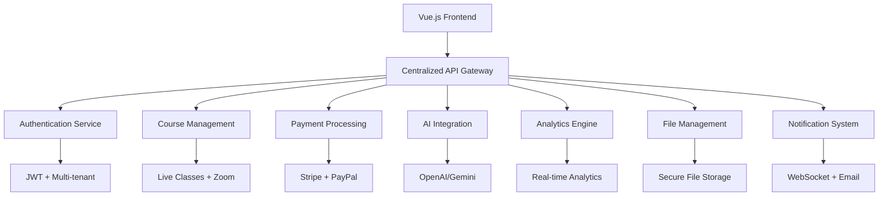

# EduRise Platform Completion Design

## Overview

This design addresses the critical gaps between frontend API calls and backend implementations in the EduRise platform. The solution focuses on completing missing endpoints, fixing broken API connections, ensuring consistent data flow, and implementing production-ready features for a comprehensive Learning Management System.

## Architecture

### Current State Analysis

The platform uses a centralized API architecture where all endpoints are routed through `apps/api/urls.py`. However, several critical gaps exist:

1. **Missing Backend Endpoints**: Frontend services call endpoints that don't exist
2. **Inconsistent API Patterns**: Some endpoints use different URL patterns
3. **Incomplete Authentication Flow**: Token refresh and social auth issues
4. **Missing Business Logic**: Payment processing, AI integration, analytics
5. **Broken File Management**: Secure downloads and permissions not implemented

### Target Architecture



## Components and Interfaces

### 1. API Endpoint Completion

#### Missing Critical Endpoints

**Authentication & User Management**
- `POST /api/v1/accounts/auth/token/refresh/` - Enhanced token refresh with tenant switching
- `GET /api/v1/users/preferences/` - User preference management
- `POST /api/v1/users/switch_tenant/` - Multi-tenant switching
- `GET /api/v1/users/export-data/` - GDPR compliance data export

**Payment System**
- `POST /api/v1/payments/create_course_payment/` - Course purchase initiation
- `POST /api/v1/payments/{id}/confirm_payment/` - Payment confirmation
- `GET /api/v1/payments/payment_analytics/` - Payment analytics
- `GET /api/v1/invoices/overdue_invoices/` - Overdue invoice management

**AI Integration**
- `POST /api/v1/ai-conversations/{id}/send_message/` - AI chat messaging
- `POST /api/v1/ai-summaries/generate/` - Content summarization
- `POST /api/v1/ai-quizzes/generate/` - Quiz generation
- `GET /api/v1/ai-usage/current_stats/` - Usage tracking

**Analytics & Reporting**
- `GET /api/v1/analytics/enrollment_trends/` - Enrollment analytics
- `GET /api/v1/analytics/user_engagement/` - User engagement metrics
- `GET /api/v1/analytics/financial_analytics/` - Financial reporting
- `GET /api/v1/analytics/course_performance/` - Course performance metrics

**File Management**
- `GET /api/v1/file-uploads/{id}/secure_url/` - Secure file access
- `POST /api/v1/files/permissions/bulk/` - Bulk permission checking
- `GET /api/v1/file-categories/` - File category management

### 2. Enhanced ViewSet Implementations

#### Course Management Enhancement
```python
class CourseViewSet(StandardViewSetMixin, viewsets.ModelViewSet):
    # Add missing actions
    @action(detail=True, methods=['post'])
    def duplicate(self, request, pk=None):
        """Duplicate course for reuse"""
        
    @action(detail=True, methods=['get'])
    def statistics(self, request, pk=None):
        """Get course statistics"""
        
    @action(detail=True, methods=['get'])
    def students(self, request, pk=None):
        """Get enrolled students"""
```

#### Payment System Integration
```python
class PaymentViewSet(viewsets.ModelViewSet):
    @action(detail=False, methods=['post'])
    def create_course_payment(self, request):
        """Initiate course purchase"""
        
    @action(detail=True, methods=['post'])
    def confirm_payment(self, request, pk=None):
        """Confirm payment completion"""
        
    @action(detail=False, methods=['get'])
    def payment_analytics(self, request):
        """Get payment analytics"""
```

### 3. Authentication & Authorization

#### Enhanced JWT Implementation
- Multi-tenant token support
- Automatic token refresh
- Social authentication integration
- Role-based permissions

#### Security Features
- Rate limiting on sensitive endpoints
- Audit logging for all actions
- IP-based access control
- Session management

### 4. Real-time Features

#### WebSocket Integration
```python
# WebSocket consumers for real-time features
class NotificationConsumer(AsyncWebsocketConsumer):
    async def connect(self):
        # Handle notification connections
        
class ChatConsumer(AsyncWebsocketConsumer):
    async def connect(self):
        # Handle chat connections
```

#### Live Class Management
- Zoom API integration
- Attendance tracking
- Recording management
- Real-time engagement metrics

## Data Models

### Enhanced Models

#### Payment Models
```python
class Payment(models.Model):
    PAYMENT_METHODS = [
        ('stripe', 'Stripe'),
        ('paypal', 'PayPal'),
        ('bank_transfer', 'Bank Transfer'),
    ]
    
    PAYMENT_STATUS = [
        ('pending', 'Pending'),
        ('completed', 'Completed'),
        ('failed', 'Failed'),
        ('refunded', 'Refunded'),
    ]
    
    user = models.ForeignKey(User, on_delete=models.CASCADE)
    course = models.ForeignKey(Course, on_delete=models.CASCADE)
    amount = models.DecimalField(max_digits=10, decimal_places=2)
    currency = models.CharField(max_length=3, default='USD')
    payment_method = models.CharField(max_length=20, choices=PAYMENT_METHODS)
    status = models.CharField(max_length=20, choices=PAYMENT_STATUS)
    stripe_payment_intent_id = models.CharField(max_length=255, blank=True)
    paypal_order_id = models.CharField(max_length=255, blank=True)
    created_at = models.DateTimeField(auto_now_add=True)
    updated_at = models.DateTimeField(auto_now=True)
```

#### AI Integration Models
```python
class AIConversation(models.Model):
    user = models.ForeignKey(User, on_delete=models.CASCADE)
    course = models.ForeignKey(Course, on_delete=models.SET_NULL, null=True)
    title = models.CharField(max_length=255)
    conversation_type = models.CharField(max_length=50)
    context = models.JSONField(default=dict)
    created_at = models.DateTimeField(auto_now_add=True)

class AIMessage(models.Model):
    conversation = models.ForeignKey(AIConversation, on_delete=models.CASCADE)
    role = models.CharField(max_length=20)  # 'user' or 'assistant'
    content = models.TextField()
    timestamp = models.DateTimeField(auto_now_add=True)
```

#### Analytics Models
```python
class UserEngagementMetric(models.Model):
    user = models.ForeignKey(User, on_delete=models.CASCADE)
    course = models.ForeignKey(Course, on_delete=models.CASCADE)
    date = models.DateField()
    time_spent_minutes = models.IntegerField(default=0)
    pages_visited = models.IntegerField(default=0)
    actions_performed = models.IntegerField(default=0)
    engagement_score = models.FloatField(default=0.0)
```

## Error Handling

### Standardized Error Responses
```python
class APIErrorResponse:
    def __init__(self, message, code=None, status=400, errors=None):
        self.response = {
            'success': False,
            'message': message,
            'code': code,
            'errors': errors,
            'timestamp': timezone.now().isoformat()
        }
        self.status = status
```

### Error Categories
1. **Authentication Errors** (401): Invalid tokens, expired sessions
2. **Authorization Errors** (403): Insufficient permissions
3. **Validation Errors** (400): Invalid input data
4. **Not Found Errors** (404): Missing resources
5. **Server Errors** (500): Internal system errors

## Testing Strategy

### Unit Testing
- Model validation and business logic
- Serializer data transformation
- ViewSet action functionality
- Authentication and permissions

### Integration Testing
- API endpoint functionality
- Database transactions
- External service integration (Stripe, Zoom, AI)
- WebSocket connections

### End-to-End Testing
- Complete user workflows
- Multi-tenant scenarios
- Payment processing flows
- Live class functionality

### Performance Testing
- API response times
- Database query optimization
- File upload/download performance
- Concurrent user handling

## Implementation Phases

### Phase 1: Core API Completion (Priority 1)
1. **Missing Endpoint Implementation**
   - Authentication endpoints
   - User management APIs
   - Basic CRUD operations

2. **API Response Standardization**
   - Consistent response format
   - Error handling middleware
   - Request/response logging

### Phase 2: Payment & Authentication (Priority 2)
1. **Payment System Integration**
   - Stripe/PayPal implementation
   - Webhook handling
   - Invoice generation

2. **Enhanced Authentication**
   - Multi-tenant support
   - Social authentication
   - Token refresh mechanism

### Phase 3: Analytics & Reporting (Priority 3)
1. **Analytics Engine**
   - Data collection
   - Metric calculation
   - Report generation

2. **Dashboard APIs**
   - Student dashboard
   - Teacher analytics
   - Admin reports

### Phase 4: AI Integration (Priority 4)
1. **AI Service Implementation**
   - Conversation management
   - Content summarization
   - Quiz generation

2. **Usage Tracking**
   - Quota management
   - Billing integration
   - Performance monitoring

### Phase 5: Advanced Features (Priority 5)
1. **Live Class Enhancement**
   - Zoom integration
   - Attendance tracking
   - Recording management

2. **File Management**
   - Secure downloads
   - Permission system
   - Bulk operations

## Security Considerations

### Data Protection
- Encryption at rest and in transit
- PII data handling
- GDPR compliance
- Audit logging

### Access Control
- Role-based permissions
- Multi-tenant isolation
- API rate limiting
- IP whitelisting

### Payment Security
- PCI DSS compliance
- Secure payment processing
- Fraud detection
- Transaction monitoring

## Performance Optimization

### Database Optimization
- Query optimization
- Index management
- Connection pooling
- Caching strategies

### API Performance
- Response compression
- Pagination implementation
- Lazy loading
- Background task processing

### Scalability
- Horizontal scaling support
- Load balancing
- CDN integration
- Microservice architecture preparation

## Monitoring and Logging

### Application Monitoring
- Performance metrics
- Error tracking
- User activity monitoring
- System health checks

### Business Metrics
- User engagement
- Course completion rates
- Revenue tracking
- System usage patterns

### Alerting System
- Critical error notifications
- Performance degradation alerts
- Security incident detection
- Business metric thresholds