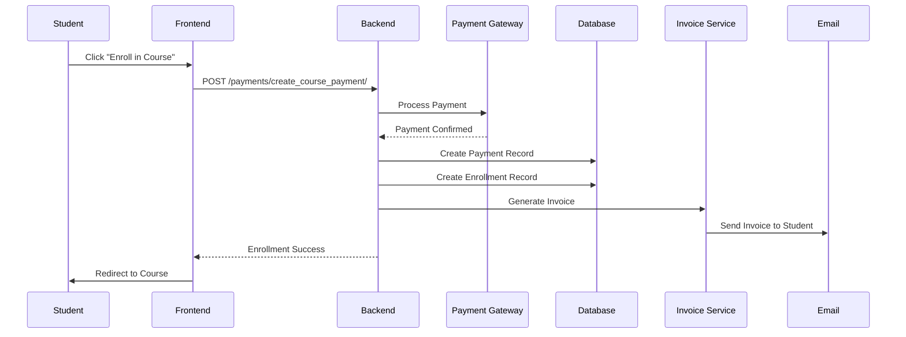

# Payment & Enrollment System Analysis

## Overview
The Edurise platform has **TWO SEPARATE** payment systems:
1. **Organization Subscriptions** - For institutional access (monthly/yearly plans)
2. **Course Enrollment Fees** - For individual course purchases

---

## 1. Organization Subscription System

### Purpose
Organizations (schools, training centers) pay for platform access with feature limits based on their plan tier.

### Subscription Plans

#### Plan Tiers (from `SubscriptionPlan` model)
- **Basic Plan**: $29/month or $290/year
  - Max 10 users
  - Max 5 courses
  - 10GB storage
  - 100 AI requests/month
  - Basic features

- **Pro Plan**: $99/month or $990/year
  - Max 50 users
  - Max 25 courses
  - 50GB storage
  - 500 AI requests/month
  - Advanced analytics
  - API access
  - Priority support

- **Enterprise Plan**: $299/month or $2990/year
  - Unlimited users
  - Unlimited courses
  - 500GB storage
  - 5000 AI requests/month
  - All Pro features plus:
    - White labeling
    - Custom integrations
    - Recording access
    - Premium content access

### Subscription Flow

#### Backend Flow (`apps/payments/services.py`)
```
1. Organization selects a plan (Basic/Pro/Enterprise)
2. SubscriptionService.create_subscription() is called
3. Payment is processed:
   - Stripe: Creates payment intent → Client secret returned
   - PayPal: Creates order → Approval URL returned
   - Bank Transfer: Generates reference → Awaits admin approval
4. On successful payment:
   - Subscription record created with start/end dates
   - Organization gets access to features based on plan
   - Invoice generated automatically
```

#### Key Backend Files:
- **Model**: `apps/payments/models.py` → `SubscriptionPlan`, `Subscription`
- **Service**: `apps/payments/services.py` → `SubscriptionService`
- **Views**: `apps/payments/views.py` → `SubscriptionViewSet`
- **Endpoints**:
  - `POST /api/v1/subscriptions/create_subscription/`
  - `GET /api/v1/subscription-plans/`
  - `POST /api/v1/subscriptions/{id}/cancel_subscription/`
  - `POST /api/v1/subscriptions/{id}/renew_subscription/`

#### Frontend Implementation:
- **Service**: `frontend/src/services/subscriptionService.ts`
- **Payment Service**: `frontend/src/services/payments.ts`
- Methods:
  ```typescript
  SubscriptionService.getPlans()
  SubscriptionService.getAllSubscriptions()
  PaymentService.createSubscription(plan, billingCycle, paymentMethod)
  PaymentService.cancelSubscription(subscriptionId)
  ```

### Subscription Features & Limits

The subscription controls:
1. **Max Users**: How many user accounts can be created
2. **Max Courses**: How many courses can be created by instructors
3. **Storage**: File upload limits
4. **AI Quota**: Number of AI-powered features per month
5. **Feature Access**:
   - Analytics dashboard
   - API access
   - White labeling
   - Priority support
   - Custom integrations
   - Recording access

### Subscription Billing

#### Billing Cycles:
- **Monthly**: Renews every 30 days
- **Yearly**: Renews every 365 days (typically 15-20% discount)

#### Auto-Renewal:
- Backend checks `current_period_end` date
- Celery task runs daily to process renewals
- Payment attempted automatically via stored payment method
- If payment fails → Status changes to 'past_due'

---

## 2. Course Enrollment Fee System

### Purpose
Individual students pay to enroll in specific courses (marketplace model).

### Course Pricing

#### From `Course` model:
```python
price = models.DecimalField(max_digits=10, decimal_places=2, null=True, blank=True)
is_public = models.BooleanField(default=False)
```

- **Public Courses**: Available on marketplace, require payment
- **Internal Courses**: Organization-only, free for enrolled users
- **Free Courses**: `price = 0` or `price = None`

### Enrollment Flow

#### Backend Flow (`apps/courses/views.py` + `apps/payments/services.py`)
```
1. Student selects a course to enroll
2. If course.is_public and course.price > 0:
   a. Payment required first
   b. Call POST /api/v1/payments/create_course_payment/
   c. PaymentService.process_course_payment() creates payment
   d. Payment processed via Stripe/PayPal/Bank Transfer
3. On successful payment:
   a. Payment status → 'completed'
   b. Enrollment record created automatically
   c. Invoice generated and sent
4. If course is free or internal:
   - Direct enrollment via POST /api/v1/courses/{id}/enroll/
```

#### Key Backend Files:
- **Models**: 
  - `apps/courses/models.py` → `Course`, `Enrollment`
  - `apps/payments/models.py` → `Payment`
- **Services**:
  - `apps/payments/services.py` → `PaymentService.process_course_payment()`
  - `apps/courses/services.py` → `EnrollmentService`
- **Views**:
  - `apps/courses/views.py` → `CourseViewSet.enroll()`
  - `apps/payments/views.py` → `PaymentViewSet.create_course_payment()`
- **Endpoints**:
  - `POST /api/v1/courses/{id}/enroll/` (free courses)
  - `POST /api/v1/payments/create_course_payment/` (paid courses)
  - `POST /api/v1/payments/{id}/confirm_payment/`

#### Frontend Implementation:
- **Service**: `frontend/src/services/courses.ts`
- **Payment Service**: `frontend/src/services/payments.ts`
- Methods:
  ```typescript
  CourseService.enrollInCourse(courseId)
  PaymentService.purchaseCourse(courseId, amount, paymentMethod)
  PaymentService.confirmPayment(paymentId)
  ```

### Enrollment Model

```python
class Enrollment:
    student: User
    course: Course
    status: 'active' | 'completed' | 'dropped' | 'suspended'
    progress_percentage: int (0-100)
    enrolled_at: DateTime
    completed_at: DateTime (nullable)
```

### Enrollment Status Tracking:
- **active**: Currently enrolled and learning
- **completed**: Finished the course (100% progress)
- **dropped**: Student withdrew
- **suspended**: Access temporarily revoked

---

## 3. Payment Methods Supported

Both systems support the same payment methods:

### 1. **Stripe** (Credit/Debit Cards)
- Real-time processing
- Uses Payment Intents API
- Requires: `STRIPE_SECRET_KEY`, `STRIPE_PUBLISHABLE_KEY`
- Flow:
  1. Backend creates payment intent
  2. Frontend receives `client_secret`
  3. Frontend uses Stripe.js to complete payment
  4. Webhook confirms success
  5. Backend updates payment status

### 2. **PayPal**
- Real-time processing
- Uses Orders API v2
- Requires: `PAYPAL_CLIENT_ID`, `PAYPAL_CLIENT_SECRET`
- Flow:
  1. Backend creates order
  2. Frontend receives `approval_url`
  3. User redirects to PayPal
  4. User approves payment
  5. Frontend captures order
  6. Backend confirms and updates status

### 3. **Bank Transfer** (Manual)
- Manual verification required
- Admin approval needed
- Flow:
  1. System generates reference number
  2. User transfers money to provided account
  3. User submits proof of transfer
  4. Admin approves or rejects
  5. Backend updates payment status

---

## 4. Payment-to-Enrollment Connection

### For Course Purchases:



### Important Note:
**Enrollments are NOT automatically created from payments!**

The connection happens through:
1. `PaymentService.confirm_payment()` marks payment as completed
2. **Manual enrollment creation** is required in the course enrollment endpoint
3. OR enrollment is created via webhook after payment confirmation

### Current Gap:
Looking at the code, I don't see automatic enrollment creation after payment completion. This needs to be implemented:

```python
# In PaymentService.confirm_payment()
if payment.payment_type == 'course' and payment.course:
    # Create enrollment after successful payment
    from apps.courses.models import Enrollment
    Enrollment.objects.get_or_create(
        student=payment.user,
        course=payment.course,
        tenant=payment.tenant,
        defaults={'status': 'active'}
    )
```

---

## 5. Invoice Generation

Both systems generate invoices automatically:

### Invoice Creation (`InvoiceService`):
- Created after payment completion
- Includes line items, tax calculation, billing address
- Sent via email with PDF attachment
- Stored in database for records

### Invoice Fields:
- Invoice number (auto-generated): `INV-YYYYMM-####`
- Issue date, due date
- Billing information
- Line items (course/subscription details)
- Subtotal, tax, discount, total
- Payment status

---

## 6. Key Differences

| Feature | Subscription | Course Enrollment |
|---------|--------------|-------------------|
| **Who Pays** | Organization | Individual Student |
| **What For** | Platform access | Specific course access |
| **Billing** | Recurring (monthly/yearly) | One-time payment |
| **Features** | User limits, storage, AI quota | Course content access |
| **Automatic Renewal** | Yes | No |
| **Refunds** | Pro-rated possible | Policy-based |
| **Access Control** | Organization-wide | Student-specific |

---

## 7. Frontend-Backend Alignment

### ✅ Properly Aligned:
- Payment creation endpoints
- Subscription plan retrieval
- Invoice generation
- Payment confirmation

### ⚠️ Potential Issues:
1. **Missing Enrollment Auto-Creation**: Payment doesn't automatically create enrollment
2. **Webhook Handling**: No clear webhook handlers for Stripe/PayPal
3. **Refund Logic**: Not implemented in either system
4. **Failed Payment Recovery**: Limited retry logic

---

## 8. Recommendations

### High Priority:
1. **Implement Auto-Enrollment**: Create enrollment record after successful course payment
2. **Add Webhooks**: Handle Stripe/PayPal webhooks for payment confirmation
3. **Add Payment Validation**: Verify course price matches payment amount
4. **Implement Refund System**: Handle refund requests and partial refunds

### Medium Priority:
5. **Add Payment Analytics**: Track conversion rates, revenue by course
6. **Implement Coupon System**: Discount codes for courses
7. **Add Subscription Upgrades**: Allow plan changes mid-cycle
8. **Trial Period**: Implement free trial for subscriptions

### Low Priority:
9. **Payment History Dashboard**: Student view of all payments
10. **Subscription Alerts**: Notify before renewal, failed payments
11. **Multi-Currency Support**: Support different currencies
12. **Installment Plans**: Pay for courses in installments

---

## 9. Testing Checklist

### Subscription Testing:
- [ ] Create subscription with Stripe
- [ ] Create subscription with PayPal
- [ ] Create subscription with bank transfer
- [ ] Cancel subscription
- [ ] Renew subscription
- [ ] Upgrade/downgrade plan
- [ ] Check feature limits enforcement

### Enrollment Testing:
- [ ] Enroll in free course
- [ ] Purchase course with Stripe
- [ ] Purchase course with PayPal
- [ ] Purchase course with bank transfer
- [ ] Verify enrollment creation
- [ ] Check course access after payment
- [ ] Test failed payment handling
- [ ] Verify invoice generation

---

## Summary

The system has two independent but well-structured payment flows:

1. **Subscriptions** = Organization-level, recurring, feature-gated access
2. **Enrollments** = Student-level, one-time, course-specific access

Both use the same payment infrastructure but serve different purposes and have different lifecycles. The main gap is the automatic enrollment creation after course payment, which should be implemented for a seamless user experience.
